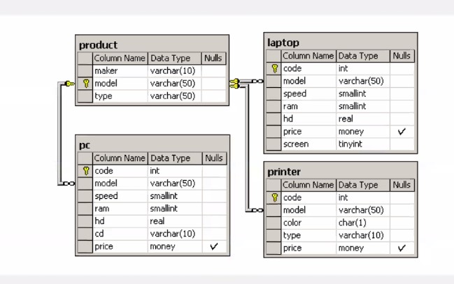

**Databases 2025: Домашнее задание 8**

Дана схема и описание таблицы

Схема базы данных состоит из четырех таблиц:

1. Product (производитель, модель, тип)  
2. PC (код, модель, скорость, ОЗУ, жесткий диск, CD, цена)  
3. Laptop (код, модель, скорость, ОЗУ, жесткий диск, экран, цена)  
4. Printer (код, модель, цвет, тип, цена)

Таблица Product содержит данные о производителе, номере модели и типе продукта ('PC', 'Laptop' или 'Printer'). Предполагается, что номера моделей в таблице Product уникальны для всех производителей и типов продуктов. Каждый персональный компьютер в таблице PC однозначно идентифицируется уникальным кодом и дополнительно характеризуется своей моделью (внешний ключ, ссылающийся на таблицу Product), скоростью процессора (в МГц) — поле speed, объемом оперативной памяти (в Мб) — поле ram, объемом жесткого диска (в Гб) — поле hd, скоростью CD-ROM (например, '4x') — поле cd и его ценой. Таблица Laptop аналогична таблице PC, за исключением того, что вместо скорости CD-ROM она содержит размер экрана (в дюймах) — поле screen. Для каждого принтера в таблице Printer указывается его тип вывода ('y' для цветного и 'n' для монохромного) — поле color, технология печати ('Laser', 'Jet' или 'Matrix') — поле type, а также цена.

1 Найдите все записи таблицы Printer для цветных принтеров.

SELECT \*  
FROM printer  
WHERE color \= ‘y’  
;  
2 Найдите номера моделей и цены всех имеющихся в продаже продуктов (любого типа) производителя B (латинская буква).

SELECT pc.model, price  
FROM pc  
JOIN product  
USING (model)  
WHERE maker \= ‘B’

UNION ALL

SELECT laptop.model, price  
FROM laptop  
JOIN product  
USING (model)  
WHERE maker \= ‘B’

UNION ALL

SELECT printer.model, price  
FROM printer  
JOIN product  
USING (model)  
WHERE maker \= ‘B’  
;

3 Найдите производителя, выпускающего ПК, но не ПК-блокноты.

WITH mt AS (  
SELECT maker, GROUP\_CONCAT(type) AS gct  
FROM product  
GROUP BY maker  
)  
SELECT maker  
FROM mt  
WHERE ‘PC’ IN gct AND ‘Laptop’ NOT IN gct  
;

4 Найдите производителей ПК с процессором не менее 450 Мгц. Вывести: Maker

SELECT maker  
FROM product  
JOIN pc  
USING (model)  
WHERE speed \>= 450  
;

5 Найдите среднюю скорость ПК.

SELECT AVG (speed) AS avg\_speed  
FROM pc  
;

6 Для каждого производителя, имеющего модели в таблице Laptop, найдите средний размер экрана выпускаемых им ПК-блокнотов.

Вывести: maker, средний размер экрана.

SELECT maker, AVG (screen) AS avg\_screen

FROM product

JOIN laptop

USING (model)

GROUP BY maker

;
